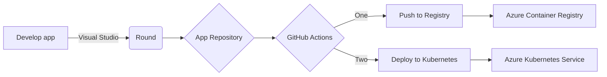

```mermaid
flowchart LR

A[Develop app] -->|Visual Studio| B(Round)
B --> C{App Repository}
C --> P{GitHub Actions}
P -->|One| D[Push to Registry]
D --> F[Azure Container Registry]
P -->|Two| E[Deploy to Kubernetes]
E --> G[Azure Kubernetes Service]
```
